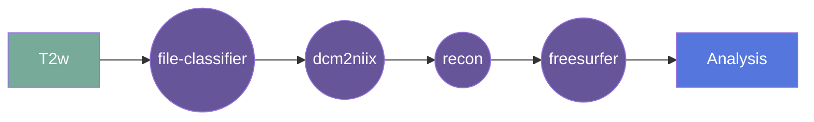

# recon-all-clinical

This gear runs recon-all-clinical which wraps SynthSR & SynthSeg tools ( https://github.com/BBillot/SynthSeg ) available in Freesurfer version 7.4.1. This is the out-of-the-box version that runs convolutiona neural networks for segmentation. 

## Overview

[Usage](#usage)

[FAQ](#faq)

### Summary
Takes an isotropic image and runs recon-all-clinical on it. The output includes a volume estimation, a QC file, a cortical thickness estimation, a parcelation file, and a Freesurfer archive zip.

The output file labels are based on the BIDS standard, taking the input file name and appending the appropriate suffixes. For example if the input file is `sub-01_ses-01_T1w.nii.gz`, the output files will be named `sub-01_ses-01_T1w_seg.nii.gz`, `sub-01_ses-01_T1w_vol.csv`, `sub-01_ses-01_T1w_qc.csv`, `sub-01_ses-01_T1w_thickness.csv`, `sub-01_ses-01_T1w_parcelation.nii.gz`, and `sub-01_ses-01_T1w_freesurfer.zip`.

### Cite

**license:**

**url:** <https://github.com/Nialljb/fw-freeSurfer-clinical-gear>

**cite:**  
SynthSeg: Domain Randomisation for Segmentation of Brain MRI Scans of any Contrast and Resolution
B. Billot, D.N. Greve, O. Puonti, A. Thielscher, K. Van Leemput, B. Fischl, A.V. Dalca, J.E. Iglesias

Robust Segmentation of Brain MRI in the Wild with Hierarchical CNNs and no Retraining
B. Billot, M. Colin, S.E. Arnold, S. Das, J.E. Iglesias
MICCAI 2022  

### Classification

*Category:* analysis

*Gear Level:*

* [ ] Project
* [x] Subject
* [x] Session
* [ ] Acquisition
* [ ] Analysis

----

### Inputs

* api-key
  * **Name**: api-key
  * **Type**: object
  * **Optional**: true
  * **Classification**: api-key
  * **Description**: Flywheel API key.

### Config

* input
  * **Base**: file
  * **Description**: input file (usually isotropic reconstruction)
  * **Optional**: false

### Outputs
* output
  * **Base**: file
  * **Description**: segmentated file 
  * **Optional**: false

* parcelation
  * **Base**: file
  * **Description**: parcelation file 
  * **Optional**: true

* vol
  * **Base**: file
  * **Description**: volume estimation file (csv)
  * **Optional**: true

* QC
  * **Base**: file
  * **Description**: QC file (csv)
  * **Optional**: true
  
* Cortical Thickness
  * **Base**: file
  * **Description**: Thickness estimation file (csv)
  * **Optional**: true

* Freesurfer archive zip
  * **Base**: file
  * **Description**: archive of Freesurfer intermediary output (zip)
  * **Optional**: true

#### Metadata

No metadata currently created by this gear

### Pre-requisites

- Three dimensional structural image

#### Prerequisite Gear Runs

This gear runs on BIDS-organized data. To have your data BIDS-ified, it is recommended
that you run, in the following order:

1. ***dcm2niix***
    * Level: Any
2. ***file-metadata-importer***
    * Level: Any
3. ***file-classifier***
    * Level: Any

#### Prerequisite

## Usage

This section provides a more detailed description of the gear, including not just WHAT
it does, but HOW it works in flywheel

### Description

This gear is run at either the `Subject` or the `Session` level. It downloads the data for that subject/session and then runs the
`recon-all-clinical` pipeline on it.

After the pipeline is run, the output folder is zipped and saved into the analysis
container.

#### File Specifications

This section contains specifications on any input files that the gear may need

### Workflow

A picture and description of the workflow

Description of workflow

1. Upload data to container
2. Prepare data by running the following gears:
   1. file classifier
   2. dcm2niix
   3. Multi-Resolution Reconstruction (MRR) {for Hyperfine Swoop data}
3. Run the recon-all-clinical gear
4. Output data is saved in the container
5. 
### Use Cases

## FAQ

[FAQ.md](FAQ.md)

## Contributing

[For more information about how to get started contributing to that gear,
checkout [CONTRIBUTING.md](CONTRIBUTING.md).]
