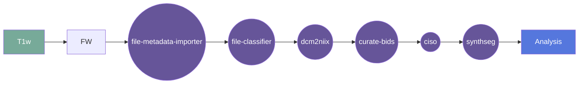

# Synthseg

This gear runs recon-all-clinical which wraps SynthSR & SynthSeg tools ( https://github.com/BBillot/SynthSeg ) available in Freesurfer version 7.4.1. This is the out-of-the-box version that runs convolutiona neural networks for segmentation. 

**Note:** 
- This gear is currently in development and is not yet available for general use.
- A version with infant models is also under development.

## Overview

[Usage](#usage)

[FAQ](#faq)

### Summary
Takes three orthogonally acquired images (axial, coronal, sagittal) collected on Hyperfine Swoop and combines into a single 1mm isotropic image. 

### Cite

**license:**

**url:** <https://gitlab.com/flywheel-io/flywheel-apps/>

**cite:**  
SynthSeg: Domain Randomisation for Segmentation of Brain MRI Scans of any Contrast and Resolution
B. Billot, D.N. Greve, O. Puonti, A. Thielscher, K. Van Leemput, B. Fischl, A.V. Dalca, J.E. Iglesias

Robust Segmentation of Brain MRI in the Wild with Hierarchical CNNs and no Retraining
B. Billot, M. Colin, S.E. Arnold, S. Das, J.E. Iglesias
MICCAI 2022  

### Classification

*Category:* analysis

*Gear Level:*

* [ ] Project
* [x] Subject
* [x] Session
* [ ] Acquisition
* [ ] Analysis

----

### Inputs

* api-key
  * **Name**: api-key
  * **Type**: object
  * **Optional**: true
  * **Classification**: api-key
  * **Description**: Flywheel API key.

### Config

* debug
  * **Name**: debug
  * **Type**: boolean
  * **Description**: Log debug messages
  * **Default**: false

* input
  * **Base**: file
  * **Description**: input file (usually isotropic reconstruction)
  * **Optional**: false

### Outputs
* output
  * **Base**: file
  * **Description**: segmentated file 
  * **Optional**: false

* parcelation
  * **Base**: file
  * **Description**: parcelation file 
  * **Optional**: true

* vol
  * **Base**: file
  * **Description**: volume estimation file (csv)
  * **Optional**: true

* QC
  * **Base**: file
  * **Description**: QC file (csv)
  * **Optional**: true

#### Metadata

No metadata currently created by this gear

### Pre-requisites

- Three dimensional structural image

#### Prerequisite Gear Runs

This gear runs on BIDS-organized data. To have your data BIDS-ified, it is recommended
that you run, in the following order:

1. ***dcm2niix***
    * Level: Any
2. ***file-metadata-importer***
    * Level: Any
3. ***file-classifier***
    * Level: Any

#### Prerequisite

## Usage

This section provides a more detailed description of the gear, including not just WHAT
it does, but HOW it works in flywheel

### Description

This gear is run at either the `Subject` or the `Session` level. It downloads the data
for that subject/session into the `/flwyhweel/v0/work/bids` folder and then runs the
`synthseg` pipeline on it.

After the pipeline is run, the output folder is zipped and saved into the analysis
container.

#### File Specifications

This section contains specifications on any input files that the gear may need

### Workflow

A picture and description of the workflow

Description of workflow

1. Upload data to container
2. Prepare data by running the following gears:
   1. file metadata importer
   2. file classifier
   3. dcm2niix
   4. MRIQC (optional)
   5. curate bids
3. Select either a subject or a session.
4. Run the ciso gear (Hyperfine triplane aquisitions)
5. Run the synthseg gear
6. Gear places output in Analysis

### Use Cases

## FAQ

[FAQ.md](FAQ.md)

## Contributing

[For more information about how to get started contributing to that gear,
checkout [CONTRIBUTING.md](CONTRIBUTING.md).]
